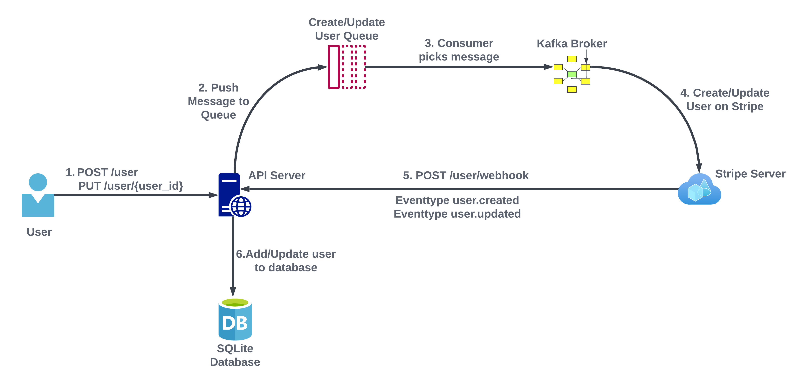

# zenskar-assignment
#### Simple FastAPI integration with Stripe using Kafka as messaging queue and SQLite as database.
## Flow Diagram


### Pre-Requisites:
1. Install Git Version Control
[ https://git-scm.com/ ]

2. Install Python Latest Version
[ https://www.python.org/downloads/ ]
      #### Use python 3.11 or above

3. Install Pip (Package Manager)
[ https://pip.pypa.io/en/stable/installing/ ]

4. Install Docker Desktop
[https://www.docker.com/products/docker-desktop/]

5. Install Node.js (For using localtunnel)
[https://nodejs.org/en/download]

6. Install Localtunnel
```
npm install -g localtunnel
```

7. Create Stripe test account and copy secret key
[https://dashboard.stripe.com/register]

8. Create a webhook on Stripe with url
[https://test-stripe.loca.lt/user/webhook]
and add events customer.created and customer.updated, also copy signing secret which we will require to verify webhook requests

### Installation
**1. Navigate to directory where you want to save the project**

**2. Clone this project**
```
git clone https://github.com/Minal-singh/zenskar-assignment.git
```

Then, Enter the project
```
cd zenskar-assignment
```
**3. Create a Virtual Environment**

Create Virtual Environment
```
python3 -m venv env
```
**4. Create .env file from .env.example in main_app/user folder and stripe_worker folder**

Add Stripe secret key and Stripe enpoint secret key(which we get after creating webhook) to .env

**5. Now we will require 5 terminals in zenskar-assignment folder. Let's name them Terminal1, Terminal2, ..... for simplicity**
1. In Terminal1 run
```
docker-compose up
```
2. In Terminal2 run
```
source env/bin/activate
cd main_app
pip install -r requirements.txt
uvicorn main:app --reload
```
3. In Terminal3 run
```
source env/bin/activate
cd stripe_worker
pip install -r requirements.txt
python3 consumer_create_user.py
```
4. In Terminal4 run
```
source env/bin/activate
cd stripe_worker
pip install -r requirements.txt
python3 consumer_update_user.py
```
5. In terminal5 run
```
lt --port 8000 --subdomain test-stripe
```
Open [https://test-stripe.loca.lt/docs] in any browser for api documentation
